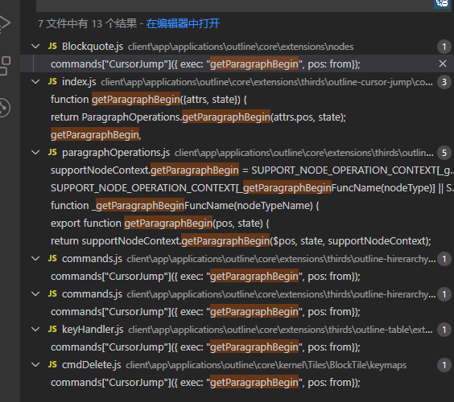

## Cmd + Delete
1. 代码块里面的删除

   1. 删到第一行的开始位置的时候无反应(新增的功能)
   2. 代码块里面的区选删除
   3. 行首删除的时候可以自动合并下行和上行的内容

2. 正文部分段落的删除

   1. 空段落删除

      1. 注意验证包括blockTile(也就是item)和logicblock两种不同结构的删除() 

         > 测试环境下通过window.OTEST.toggleBlockBorder(),红色区域为logicblock

   2. 配合有序列表/无序列表的删除

   3. 配合tab键的删除

   4. nodeSelection(图片,地图等的处理)

   5. 在图片下面删掉后自动选中等.

3. 表格里面的删除

   1. 行选/列选/单元格选的删除(三选一，挑一个看即可，逻辑一致，沿用backspace)
   2. 单元格里面的删除
      1. 区选的删除(仅仅是文本的那种选中，而不是单元格的选中)
      2. 非区选但是在段首的删除
      3. 没内容的时候什么也不干，操作无效

4. 引用块里面的删除

   1. 注意和tab键的配合(这里的规则很不一样)
   2. 删到第一行的开头的时候的效果和backspace一致
   3. 行首删除的时候合并

## Control-K

​	类似上面的Cmd+Delete，但是是删段尾删除

直接搜索getParagraphBegin的地方,另外补上getParagraphEnd即可。

- [x] client\app\applications\outline\core\extensions\nodes\Blockquote.js		
- [x] client\app\applications\outline\core\extensions\thirds\outline-hirerarchy\Indent\keyHandlers\commands.js
- [x] client\app\applications\outline\core\extensions\thirds\outline-hirerarchy\OutlineList\commands.js
- [x] client\app\applications\outline\core\extensions\thirds\outline-table\extension\keyHandler.js
- [x] client\app\applications\outline\core\kernel\Tiles\BlockTile\keymaps\cmdDelete.js

影响面同上类似

